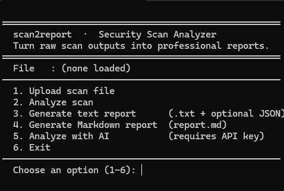

# 🚀 scan2report

Turn messy security scan outputs into clean, professional AI-powered reports in seconds.

## 💥 Problem
Tools like Nmap and Nikto generate raw output that is hard to understand.

## ✅ Solution
scan2report automatically analyzes and converts them into readable reports with risk levels and recommendations.

**scan2report** solves that by:

* Parsing raw scan results
* Analyzing them with AI
* Generating clean, readable security reports

---

## ⚡ Features

* 📂 Upload scan outputs (Nmap, Nikto, SQLmap)
* 🧠 AI-powered vulnerability analysis
* 📊 Risk classification (Low / Medium / High)
* 📄 Professional report generation
* 💻 Beginner-friendly interface

---

## 📸 Demo



### Raw Input (Example)

```
PORT   STATE SERVICE
80/tcp open  http
22/tcp open  ssh
```

### Output

* Port 80 (HTTP) → Possible web vulnerabilities
* Port 22 (SSH) → Check for weak credentials
* Risk Level: Medium

---

## ⚙️ Installation

```bash
git clone https://github.com/creatorhun-hub/scan2report.git
cd scan2report
pip install -r requirements.txt
```

---

## ▶️ Usage

```bash
python main.py
```

---

## 🧠 Tech Stack

* Python
* AI (Replicate API)
* CLI / Flask

---

## ⚠️ Disclaimer

This tool is for **educational and authorized security testing only**.
Do NOT use it on systems you don’t own or have permission to test.

---

## 🌟 Contributing

Pull requests are welcome!
If you have ideas for improvements, feel free to open an issue.

---

## 📌 Roadmap

* [ ] Web dashboard UI
* [ ] PDF report export
* [ ] More tool integrations
* [ ] Dark mode UI 😎

---

## ⭐ Support

If you find this useful, consider giving it a star ⭐
